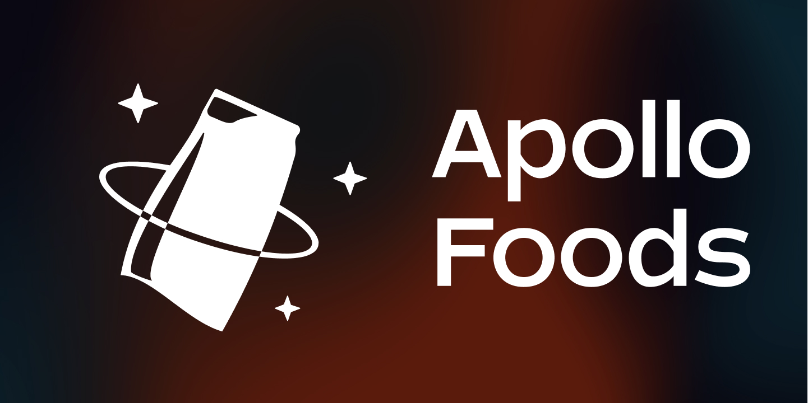

# Dokumentation

Eine technische Beschreibung der Umsetzung (in der Sie die Struktur des Codes und
etwaige Besonderheiten beschreiben (z.B. in Worten, mit Diagrammen, Screenshots der
Ordnerstruktur, etc.)

## Lokales Entwickeln

Um Apollo Foods lokal ausführen zu können, verwendet man diese Kommandos:

```bash
npm install
npx next
```

Bitte wenden Sie sich an den Maintainer @motcodes, um alle nötigen API Keys, für die Anmelde Funktionen, sowie die URLs für die Datenbank zu bekommen. Danach ist es möglich das Prisma Studio auszuführen:

```bash
npx prisma studio
```

## Ordner Struktur


Die Ordner Struktur ist nach dem Prinzip eines typischen NextJs Projektes aufgebaut.

### Erklärung der Ordner

- .next/
  - ist eine Caching Ordner und dient zum schnellen Laden und Interpretieren des Codes
- components/
  - Besitzt, wie der Name schon sagt, alle benutzerdefinierten Komponenten.
  - Hier findet man Icons, sowie die Stage Komponente, welche für das Generieren der 3D Objekte zuständig ist.
- images/
  - Enthält Bilder und SVGs
- lib/
  - wird als Funktionen und React-Hooks Ordner verwendet
  - diese Funktionen können 3 oder mehr Zeilen aufweisen
  - dient vor allem dem Code-Splitting und der Leserlichkeit des Codes
  - alle Funktionen werden in der `index.js` Datei exportiert, so dass man in einer Komponente z.B. nur `../lib` aufrufen muss, um mehrerer Funktionen importieren zu können.
- node_modules/
  - Apollo Foods basiert auf NodeJs, daher der Package Ordner
- pages/
  - enthält alle "Seiten" die User besuchen kann
  - der Datei Name ist die Route
    - credits.jsx -> apollofoods.matthiasoberholzer.com/credits
  - im Kompilierungsprozess werden die Dateien, je nach Funktion, die die Seite erfüllt, bereits zu einem HTML-File erstellt. Das hilft der Performance und dem SEO
  - api/
    - diese Ordner umfasst alle API-Routen, wie das Speichern und Löschen von Benutztern
    - Die API greift auf die DB zu.
  - cook/[id].jsx
    - Die eckigen Klammern sind eine Eigenheit von NextJS
    - es wird der Inhalt von diesem File gerendert
    - für den User wird die `id` aufgelöst
      - cook/[id].jsx -> apollofoods.matthiasoberholzer.com/cook/52806
  - u/[username]/
    - Die eckigen Klammern sind eine Eigenheit von NextJS
    - es wird der Inhalt von dem `index.js` wird hier gerendert
    - für den User wird der `[username]` aufgelöst
      - u/[username]/index.jsx -> apollofoods.matthiasoberholzer.com/u/daveGrohl
    - Hier wird die Ordner Version dieses Verfahrens verwendet damit weiter Routen abhängig vom Benutzer gerendert werden können.
      - u/[username]/settings.jsx -> apollofoods.matthiasoberholzer.com/u/daveGrohl/settings
  - prisma
    - enthält das Datenbank Schema als `.prisma` Datei
    - beim Hochladen des Schemas wird es automatisch zu einem `.sql` umgewandelt
    - das `prisma.js` File dient als Singelton, um nicht jedes mal einen neuen Client zu eröffnen.
      - muss Server seitig importiert werden
      - bei Client seitigen Import tritt ein Fehler auf, darum findet man es im `prisma/` Ordner und nicht im `lib/` Ordner
  - public/
    - alles was im public Ordner ist wird dem Besucher beim Laden mitgeliefert und ist auch von der Domain aufrufbar
    - enthält favicon, manifest, font und das 3D-Pouch-Model
  - styles/
    - wird verwendet um den lokalen Font zu laden
  - utils/
    - umfasst eine Reihe von UI-Elementen, wie Button, Input, Link, Typography ...
    - alle Dateien werden in einer `index.js` Datei gesammelt, um beim Importierne nur den Ordner referenzieren zu müssen.
  - .babelrc
    - ist die Konfigurationsdatei vom JS Compiler Babel
    - besitzt die Konfiguration um Styled-Components Server Seitig zu laden.
  - .env
    - enthält vertrauliche API-Keys und die Domain zum Datenbanken Server
    - soll unter keinen umständen an nicht autorisierte Personen weiter gegeben werden
  - .gitignore
    - welche Dateien nicht an das Repository hochgeladen werden sollten.
  - next.config.js
    - ist die Konfigurationsdatei vom NextJs Framework
    - hier kann man Flags setzten
    - auch die Image-Provider werden hier angegeben, um nicht registrierte Bilder-Domain zu blockieren.
  - package-lock.json & package.json
    - ist die Konfigurationsdatei für NodeJs
    - enthält Informationen zum Projekt und eine List von Paketen die verwendet werden.
  - prettier.config.js
    - ist die Konfigurationsdatei von Prettier
    - dient zur benutzerdefinierten Formatierung von Code Zeilen
  - README.md
    - Kurz Info zum Projekt
